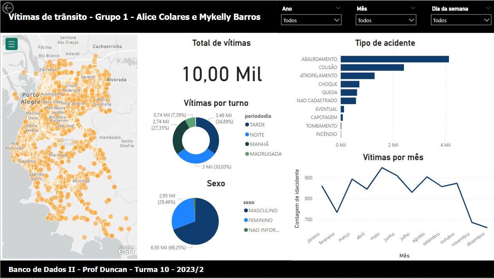

<h1>Dashboard em PowerBI de Vítimas de Acidentes de Trânsito</h1>

Este trabalho consistia na construção de uma solução de BI (Inteligência de Negócio) a partir de dados coletados
de uma fonte de dados abertos (open data). A fonte de dados é uma amostra dos conjuntos de dados de acidentes de
trânsito.

<h3>Requisitos:</h3>

O dashboard deve conter as seguintes visualizações:
- Tipo de Acidente (barras horizontais)
- Vítimas por Sexo (gráfico de pizza)
- Vítimas por Turno do Dia (gráfico de rosca)
- Vítimas por mês, para cada ano (gráfico de linhas)
- Total de vítimas (cartão)
- Incluir a visualização ArcGIS Maps para as latitudes e longitudes dos acidentes por número de vítimas.

Os filtros (segmentação dos dados) no dashboard, na forma de lista suspensa, devem controlar todas asoutras visualizações, e devem ser:
- Por Ano
- Por Mês
- Por Dia da Semana

<h3>Resultado final:</h3>

